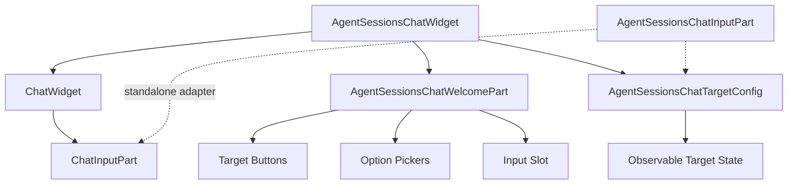
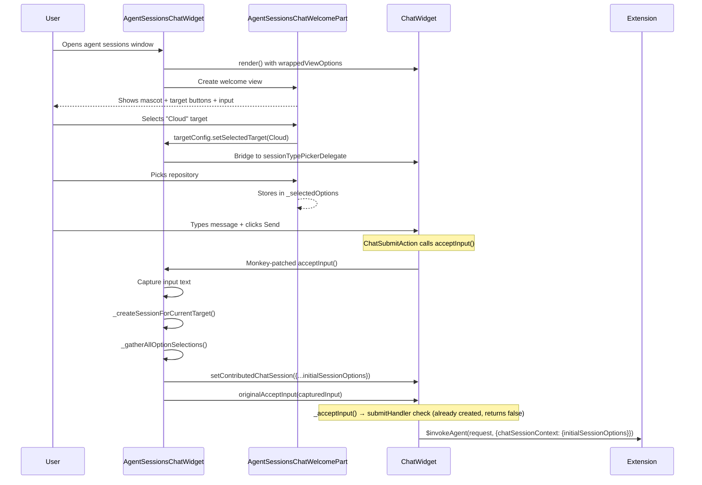
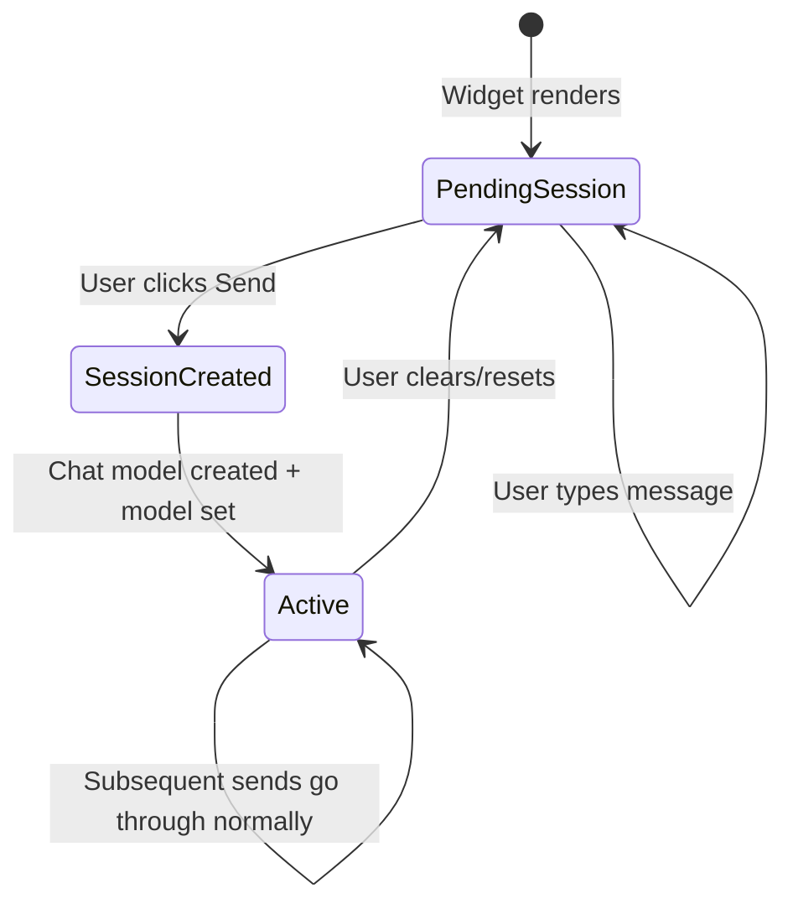
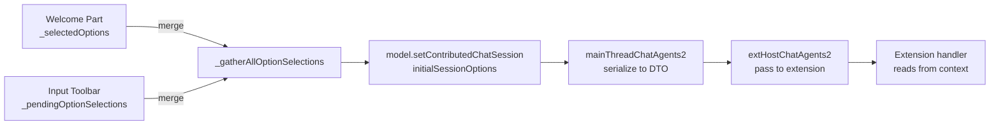

# Agent Sessions Chat Widget Architecture

This document describes the architecture of the **Agent Sessions Chat Widget** (`AgentSessionsChatWidget`), a new extensible chat widget designed for the agent sessions window. It replaces the tightly-coupled agent session logic inside `ChatWidget` and `ChatInputPart` with a clean, composable system built around the wrapper pattern.

---

## 1. Motivation: Why a New Architecture?

### The Problem with Patching Core Widgets

The original approach to supporting agent sessions involved adding agent-specific logic directly into the core `ChatWidget` and `ChatInputPart`. Over time, this led to significant coupling and code complexity:

**Inside `ChatWidget` (~100+ lines of agent-specific code):**
- `ChatFullWelcomePart` is directly instantiated inside `ChatWidget.render()`, with the widget reaching into the welcome part's DOM to reparent the input element between `fullWelcomePart.inputSlot` and `mainInputContainer`
- `showFullWelcome` creates a forked rendering path — 5+ conditional branches in `render()`, `updateChatViewVisibility()`, and `renderWelcomeViewContentIfNeeded()`
- `lockToCodingAgent()` / `unlockFromCodingAgent()` add ~55 lines of method code plus ~20 lines of scattered `_lockedAgent`-gated logic throughout `clear()`, `forcedAgent` computation, welcome content generation, and scroll lock behavior
- The `_lockedToCodingAgentContextKey` context key is set/read in many places, creating implicit coupling between agent session state and widget rendering

**Inside `ChatInputPart` (~50+ lines of agent-specific code):**
- Imports `AgentSessionProviders`, `getAgentSessionProvider`, `getAgentSessionProviderName` directly
- Manages `_pendingDelegationTarget`, `agentSessionTypeKey` context key, and `sessionTargetWidget`
- Has ~15 call sites checking `sessionTypePickerDelegate?.getActiveSessionProvider()` to determine option groups, picker rendering, and session type handling
- `getEffectiveSessionType()` resolves session type through a delegate → session context → fallback chain

**Consequences:**
- **Fragile changes** — modifying agent session behavior requires touching core `ChatWidget` internals, risking regressions in the standard chat experience
- **Testing difficulty** — agent session logic is interleaved with general chat logic, making it hard to test either in isolation
- **Feature creep** — every new agent session feature (target restriction, deferred creation, cached option groups) adds more conditional branches to shared code
- **Unclear ownership** — it's hard to tell where "chat widget" ends and "agent sessions" begins

### The Solution: Composition Over Modification

The `AgentSessionsChatWidget` wraps `ChatWidget` instead of patching it. Agent-specific behavior lives in self-contained components that compose with the core widget through well-defined interfaces (`submitHandler`, `hiddenPickerIds`, `excludeOptionGroup`, `ISessionTypePickerDelegate` bridge). The core `ChatWidget` requires no agent-specific modifications.

---

## 2. Overview

The Agent Sessions Chat Widget provides:

- **Deferred session creation** — the UI is fully interactive before any session resource exists
- **Target configuration** — users select which agent provider (Local, Cloud, etc.) to use
- **Welcome view** — a branded empty-state experience with mascot, target buttons, and option pickers
- **Initial session options** — option selections travel atomically with the first request to the extension
- **Configurable picker placement** — pickers can be rendered in the welcome view, input toolbar, or both



> **Note:** `AgentSessionsChatInputPart` is a standalone adapter that bridges `IAgentChatTargetConfig` to `ChatInputPart`. It is available for consumers that need a `ChatInputPart` outside of a full `ChatWidget`, but `AgentSessionsChatWidget` itself creates the bridge delegate inline and passes it through `wrappedViewOptions` to the `ChatWidget`'s own `ChatInputPart`.

---

## 3. Key Components

### 3.1 `AgentSessionsChatWidget`

**Location:** `src/vs/sessions/browser/widget/agentSessionsChatWidget.ts`

The main wrapper around `ChatWidget`. It:

1. **Owns the target config** — creates `AgentSessionsChatTargetConfig` from provided options
2. **Intercepts submission via two mechanisms** — uses `submitHandler` to create the session on first send, and monkey-patches `acceptInput` to attach `initialSessionOptions` to the session context
3. **Manages the welcome view** — shows `AgentSessionsChatWelcomePart` when the chat is empty
4. **Gathers initial options** — collects all option selections and attaches them to the session context
5. **Hides duplicate pickers** — uses `hiddenPickerIds` and `excludeOptionGroup` to avoid showing pickers in both the welcome view and input toolbar
6. **Caches option groups** — persists extension-contributed option groups to `StorageService` so pickers render immediately on next load before extensions activate

#### Submission Interception: Two Mechanisms

The widget uses two complementary interception points:

- **`submitHandler`** (in `wrappedViewOptions`): Called by `ChatWidget._acceptInput()` before the normal send flow. If the session hasn't been created yet, it calls `_createSessionForCurrentTarget()`, restores the input text (which gets cleared by `setModel()`), and returns `false` to let the normal flow continue.
- **Monkey-patched `acceptInput`**: Called when `ChatSubmitAction` directly invokes `chatWidget.acceptInput()`. This captures the input text, creates the session if needed, then calls `_gatherAllOptionSelections()` to merge all option picks and attaches them to `contributedChatSession.initialSessionOptions` before delegating to the original `acceptInput`.

Both paths converge on the same session creation and option gathering logic. The `submitHandler` handles the ChatWidget-internal send path, while the monkey-patch handles external callers (like `ChatSubmitAction`).



### 3.2 `AgentSessionsChatTargetConfig`

**Location:** `src/vs/sessions/browser/widget/agentSessionsChatTargetConfig.ts`

A reactive configuration object that tracks:

- **Allowed targets** — which agent providers are available (e.g., `[Background, Cloud]`)
- **Selected target** — which provider the user has chosen
- **Events** — fires when the target or allowed set changes

```typescript
interface IAgentChatTargetConfig {
    readonly allowedTargets: IObservable<ReadonlySet<AgentSessionProviders>>;
    readonly selectedTarget: IObservable<AgentSessionProviders | undefined>;
    readonly onDidChangeSelectedTarget: Event<AgentSessionProviders | undefined>;
    readonly onDidChangeAllowedTargets: Event<ReadonlySet<AgentSessionProviders>>;
    setSelectedTarget(target: AgentSessionProviders): void;
    addAllowedTarget(target: AgentSessionProviders): void;
    removeAllowedTarget(target: AgentSessionProviders): void;
    setAllowedTargets(targets: AgentSessionProviders[]): void;
}
```

The target config is **purely UI state** — changing targets does NOT create sessions or resources.

### 3.3 `AgentSessionsChatWelcomePart`

**Location:** `src/vs/sessions/browser/parts/agentSessionsChatWelcomePart.ts`

Renders the welcome view when the chat is empty:

- **Mascot** — product branding image
- **Target buttons** — Local / Cloud toggle with sliding indicator
- **Option pickers** — extension-contributed option groups (repository, folder, etc.)
- **Input slot** — where the chat input is placed when in welcome mode

The welcome part reads from `IAgentChatTargetConfig` and the `IChatSessionsService` for option groups.

### 3.4 `AgentSessionsChatInputPart`

**Location:** `src/vs/sessions/browser/parts/agentSessionsChatInputPart.ts`

A standalone adapter around `ChatInputPart` that bridges `IAgentChatTargetConfig` to the existing `ISessionTypePickerDelegate` interface. It creates a `createTargetConfigDelegate()` bridge so the standard `ChatInputPart` can work with the new target config system without modifications.

**Important:** `AgentSessionsChatWidget` does *not* use this adapter directly. Instead, it creates its own bridge delegate inline and passes it to `ChatWidget` via `wrappedViewOptions.sessionTypePickerDelegate`. The `AgentSessionsChatInputPart` is available for consumers that need a `ChatInputPart` with target config integration outside the context of a full `ChatWidget` (e.g., a detached input field).

### 3.5 `AgentSessionsTargetPickerActionItem`

**Location:** `src/vs/sessions/browser/widget/agentSessionsTargetPickerActionItem.ts`

A dropdown picker action item for the input toolbar that reads available targets from `IAgentChatTargetConfig` (rather than `chatSessionsService`). Selection calls `targetConfig.setSelectedTarget()` with no session creation side effects. It renders the current target's icon and name, with a chevron to open the dropdown of allowed targets. The picker automatically re-renders when the selected target or allowed targets change.

---

## 4. Chat Input Lifecycle: First Load vs New Session

The chat input behaves differently depending on whether it's the very first load (before the extension activates) or a subsequent "New Session" after the extension is already active.

### 4.1 First Load (Extension Not Yet Activated)

When the agent sessions window opens for the first time:

1. The `ChatWidget` renders with **no model** — `viewModel` is `undefined`
2. `ChatInputPart` has no `sessionResource`, so pickers query the `sessionTypePickerDelegate` for the effective session type
3. The extension hasn't activated yet, so:
   - `chatSessionHasModels` context key is `false` (no option groups registered)
   - `lockedToCodingAgent` is `false` (contribution not available yet)
   - The `ChatSessionPrimaryPickerAction` menu item is **hidden** (its `when` clause requires both)
4. **Cached option groups** (from a previous run) are loaded from storage and seeded into the service, allowing pickers to render immediately with stale-but-useful data
5. **Pending session resource** — `_generatePendingSessionResource()` generates a lightweight URI (e.g., `copilotcli:/untitled-<uuid>`) synchronously. No async work or extension activation needed. This resource allows picker commands and `notifySessionOptionsChange` events to flow through the existing pipeline.
6. When the extension activates:
   - `onDidChangeAvailability` fires → `updateWidgetLockStateFromSessionType` sets `lockedToCodingAgent = true`
   - `onDidChangeOptionGroups` fires with fresh data → `chatSessionHasModels = true`
   - The `when` clause is now satisfied → toolbar re-renders with the picker action
   - The welcome part re-renders pickers with live data from the extension
7. **Extension can now fire `notifySessionOptionsChange`** with the pending resource — the service stores values in `_pendingSessionOptions`, fires `onDidChangeSessionOptions`, and the welcome part and `ChatInputPart` match the resource and sync picker state.

```
State: No viewModel, _pendingSessionResource is set immediately (sync)
ChatInputPart: Uses delegate.getActiveSessionProvider() for session type
Pickers: Initially hidden, appear when extension activates
Option groups: Cached from storage → overwritten by extension
Session options: Stored in lightweight _pendingSessionOptions map (no ContributedChatSessionData)
```

### 4.2 New Session (Extension Already Active)

When the user clicks "New Session" after completing a request:

1. `resetSession()` is called
2. The old model is cleared via `setModel(undefined)` and the model ref is disposed
3. `_sessionCreated` is reset to `false`
4. `_pendingSessionResource` is cleared
5. Pending option selections from `ChatInputPart` are cleared via `takePendingOptionSelections()`
6. The welcome view becomes visible and pickers are re-rendered via `resetSelectedOptions()`
7. `_generatePendingSessionResource()` generates a fresh pending resource (synchronous)
8. The `ChatWidget` again has **no model** — same as first load from the input's perspective
9. BUT the extension is already active, so:
   - `lockedToCodingAgent` is already `true` (contribution is available)
   - `chatSessionHasModels` is already `true` (option groups are registered)
   - Pickers render **immediately** with live data — no waiting for extension activation
   - Option groups are fresh (not stale cached data)
   - `getOrCreateChatSession` resolves quickly since the content provider is already registered

```
State: No viewModel, _pendingSessionResource set after init
ChatInputPart: Uses delegate.getActiveSessionProvider() for session type
Pickers: Render immediately (extension already active, context keys already set)
Option groups: Live data from extension (already registered)
```

### 4.3 Key Differences

| Aspect | First Load | New Session |
|--------|-----------|-------------|
| Extension state | Not activated | Already active |
| `lockedToCodingAgent` | `false` → `true` (async) | Already `true` |
| `chatSessionHasModels` | `false` → `true` (async) | Already `true` |
| Input toolbar pickers | Hidden → appear on activation | Visible immediately |
| Welcome part pickers | Cached → replaced with live data | Live data from start |
| Session resource | Generated as pending, session data created eagerly | Old cleared, new pending generated |
| `_pendingSessionResource` | Set after `getOrCreateChatSession` completes | Cleared and re-initialized |
| `_pendingOptionSelections` | Empty | Cleared via `takePendingOptionSelections()` |
| Extension option changes | Received after pending init completes | Received immediately |

### 4.4 The `locked` Flag and Session Reset

Extensions can mark option items as `locked` (e.g., locking the folder picker after a request starts). This is a **session-specific** concept:

- During an active session, the extension sends `notifySessionOptionsChange` with `{ ...option, locked: true }`
- The welcome part syncs these via `syncOptionsFromSession`, but **strips the `locked` flag** before storing in `_selectedOptions`
- This ensures that when the welcome view re-renders (e.g., after reset), pickers are always interactive
- Locking only affects the `ChatSessionPickerActionItem` widget's `currentOption.locked` check, which disables the dropdown

---

## 5. Resourceless Chat Input

### The Problem

Traditional chat sessions require a session resource (URI) to exist before the user can interact. This means:
- Extensions must register and load before the UI is usable
- Creating a session involves an async round-trip to the extension
- The user sees a loading state instead of being productive

### The Solution

The Agent Sessions Chat Widget defers **chat model creation** to the **moment of first submit**, but eagerly initializes **session data** so extensions can interact with options before the user sends a message:



**Before chat model creation (pending session state):**
- A **pending session resource** is generated via `getResourceForNewChatSession()` and `chatSessionsService.getOrCreateChatSession()` is called eagerly. This creates session data (options store) and invokes `provideChatSessionContent` so the extension knows the resource.
- The extension can fire `notifySessionOptionsChange(pendingResource, updates)` at any time — the welcome part matches the pending resource and syncs option values.
- Target selection is tracked in `AgentSessionsChatTargetConfig`
- User option selections are cached in `_pendingOptionSelections` (ChatInputPart) and `_selectedOptions` (welcome part), AND forwarded to the extension via `notifySessionOptionsChange` using the pending resource.
- The chat input works normally — user can type, attach context, change mode

**At chat model creation (triggered by either `submitHandler` or the patched `acceptInput`):**
1. `_createSessionForCurrentTarget()` reads the current target from the config
2. **Reuses the pending session resource** (the same URI used for session data) — no new resource is generated
3. For non-local targets, calls `loadSessionForResource(resource, location, CancellationToken.None)` which reuses the existing session data from `getOrCreateChatSession()`; for local targets, calls `startSession(location)` directly
4. Sets the model on the `ChatWidget` via `setModel()` (this clears the input editor, so the input text is captured and restored)
5. `_gatherAllOptionSelections()` collects options from welcome part + input toolbar
6. Options are attached to `contributedChatSession.initialSessionOptions` via `model.setContributedChatSession()`
7. The request proceeds through the normal `ChatWidget._acceptInput` flow

---

## 6. Initial Session Options (`initialSessionOptions`)

### The Problem

When a session is created on first submit, the extension needs to know what options the user selected (model, repository, agent, etc.). But the traditional `provideHandleOptionsChange` mechanism is async and fire-and-forget — there's no guarantee the extension processes it before the request arrives.

### The Solution

Options travel **atomically with the first request** via `initialSessionOptions` on the `ChatSessionContext`:



### Data Flow

| Layer | Type | Field |
|-------|------|-------|
| Internal model | `IChatSessionContext` | `initialSessionOptions?: ReadonlyArray<{optionId: string, value: string \| { id: string; name: string }}>` |
| Protocol DTO | `IChatSessionContextDto` | `initialSessionOptions?: ReadonlyArray<{optionId: string, value: string}>` |
| Extension API | `ChatSessionContext` | `initialSessionOptions?: ReadonlyArray<{optionId: string, value: string}>` |

> **Note:** The internal model allows `value` to be either a `string` or `{ id, name }` (matching `IChatSessionProviderOptionItem`'s structural type). During serialization to the protocol DTO in `mainThreadChatAgents2`, the value is converted to `string`. The extension always receives `string` values.

### Extension Usage

```typescript
// In the extension's request handler:
async handleRequest(request, context, stream, token) {
    const { chatSessionContext } = context;

    // ⚠️ IMPORTANT: Apply initial options BEFORE any code that reads
    // folder/model/agent state (e.g., lockRepoOption, hasUncommittedChanges).
    // The initialSessionOptions override defaults set by provideChatSessionContent.
    const initialOptions = chatSessionContext?.initialSessionOptions;
    if (initialOptions) {
        for (const { optionId, value } of initialOptions) {
            // Apply options to internal state
            if (optionId === 'model') { setModel(value); }
            if (optionId === 'repository') { setRepository(value); }
        }
    }

    // Now downstream reads (trust checks, uncommitted changes, etc.)
    // see the correct options.
    // ...
}
```

### Priority Order

When `_gatherAllOptionSelections()` merges options:

1. **Welcome part selections** (lowest priority) — includes defaults for repository/folder pickers
2. **Input toolbar selections** (highest priority) — explicit user picks override welcome defaults

---

## 7. Picker Placement

Pickers can appear in two locations:
- **Welcome view** — above the input, managed by `AgentSessionsChatWelcomePart`
- **Input toolbar** — inside the chat input, managed by `ChatInputPart`

To avoid duplication, the widget uses two mechanisms:

### `hiddenPickerIds`

Hides entire picker actions from the input toolbar:

```typescript
hiddenPickerIds: new Set([
    OpenSessionTargetPickerAction.ID,   // Target picker in welcome
    OpenModePickerAction.ID,             // Mode picker hidden
    OpenModelPickerAction.ID,            // Model picker hidden
    ConfigureToolsAction.ID,             // Tools config hidden
])
```

### `excludeOptionGroup`

Selectively excludes specific option groups from `ChatSessionPrimaryPickerAction` in the input toolbar while keeping others:

```typescript
excludeOptionGroup: (group) => {
    const idLower = group.id.toLowerCase();
    const nameLower = group.name.toLowerCase();
    // Repository/folder pickers are in the welcome view
    return idLower === 'repositories' || idLower === 'folders' ||
        nameLower === 'repository' || nameLower === 'repositories' ||
        nameLower === 'folder' || nameLower === 'folders';
}
```

This allows the input toolbar to still show model pickers from `ChatSessionPrimaryPickerAction` while the welcome view handles the repository picker.

```mermaid
graph TB
    subgraph "Welcome View (above input)"
        T[Target Buttons<br/>Local | Cloud]
        R[Repository Picker<br/>via excludeOptionGroup]
    end

    subgraph "Input Toolbar (inside input)"
        M[Model Picker<br/>from ChatSessionPrimaryPickerAction]
        S[Send Button]
    end

    subgraph "Hidden from toolbar"
        H1[Target Picker<br/>hiddenPickerIds]
        H2[Mode Picker<br/>hiddenPickerIds]
    end
```

---

## 8. File Structure

```
src/vs/sessions/browser/widget/
├── AGENTS_CHAT_WIDGET.md                    # This document
├── agentSessionsChatWidget.ts               # Main widget wrapper
├── agentSessionsChatTargetConfig.ts         # Target configuration (observable)
├── agentSessionsTargetPickerActionItem.ts   # Target picker for input toolbar
└── media/
    └── agentSessionsChatWidget.css          # Widget-specific styles

src/vs/sessions/browser/parts/
├── agentSessionsChatInputPart.ts            # Input part adapter
└── agentSessionsChatWelcomePart.ts          # Welcome view (mascot + pickers)
```

---

## 9. Adding a New Agent Provider

To add a new agent provider (e.g., "Codex"):

1. **Add to `AgentSessionProviders` enum** in `agentSessions.ts`
2. **Update target config** in `chatViewPane.ts`:
   ```typescript
   allowedTargets: [Background, Cloud, Codex]
   ```
3. **Register session content provider** in the extension
4. **Handle `initialSessionOptions`** in the extension's request handler
5. **Register option groups** via `provideChatSessionProviderOptions`

The welcome part and input toolbar automatically pick up new targets and option groups.

---

## 10. Comparison with Old Architecture

### Side-by-Side

| Aspect | Old (`ChatFullWelcomePart` inside `ChatWidget`) | New (`AgentSessionsChatWidget` wrapper) |
|--------|---------------------------|--------------------------------|
| Session creation | Eager (on load) | Deferred (on first send) |
| Target selection | `ISessionTypePickerDelegate` callback | `IAgentChatTargetConfig` observable |
| Option delivery | `provideHandleOptionsChange` (async, fire-and-forget) | `initialSessionOptions` (atomic with request) |
| Welcome view | Inside `ChatWidget` via `showFullWelcome` flag | Separate `AgentSessionsChatWelcomePart` |
| Picker placement | Hardcoded in `ChatInputPart` | Configurable via `hiddenPickerIds` + `excludeOptionGroup` |
| Input reparenting | `ChatWidget` reaches into welcome part's DOM | `AgentSessionsChatWidget` manages its own DOM layout |
| Agent lock state | `lockToCodingAgent()` / `unlockFromCodingAgent()` on `ChatWidget` | Not needed — target config is external state |
| Extensibility | Requires modifying `ChatWidget` internals | Self-contained, composable components |

### Benefits of the New Architecture

**1. Clean Separation of Concerns**

The old approach embeds agent session logic (target selection, welcome view, lock state, option caching) directly inside `ChatWidget`. This means every agent feature touches the same file that powers the standard chat experience. The new architecture keeps `ChatWidget` focused on its core responsibility — rendering a chat conversation — and pushes agent-specific behavior into dedicated components.

**2. Reduced Risk of Regressions**

In the old architecture, `ChatWidget.render()` has forked control flow gated on `showFullWelcome`, and `ChatInputPart` has ~15 call sites checking session type delegates. A change to how pickers render could break the standard chat. In the new architecture, `AgentSessionsChatWidget` composes with `ChatWidget` through stable, narrow interfaces (`submitHandler`, `hiddenPickerIds`, `excludeOptionGroup`), so changes to agent session behavior cannot break the core widget.

**3. Testable in Isolation**

`AgentSessionsChatTargetConfig` can be unit-tested independently — it's a pure observable state container with no DOM or service dependencies beyond `Disposable`. The old `ISessionTypePickerDelegate` was an ad-hoc callback interface defined inline, making it harder to mock and test.

**4. Deferred Session Creation**

The old architecture creates sessions eagerly, requiring an async round-trip to the extension before the UI is usable. The new architecture lets the user interact immediately (type, select targets, pick options) and only creates the session on first send. This eliminates the loading state and makes the initial experience feel instant.

**5. Atomic Option Delivery**

The old `provideHandleOptionsChange` mechanism sends option changes asynchronously — if the user changes a repository picker and immediately sends a message, there's a race condition where the extension might not have processed the option change yet. The new `initialSessionOptions` mechanism bundles all option selections with the first request, guaranteeing the extension sees the correct state.

**6. Easier to Add New Agent Providers**

Adding a new provider in the old architecture requires modifying `ChatWidget`, `ChatInputPart`, and `ChatFullWelcomePart`. In the new architecture, it's a matter of adding to the `AgentSessionProviders` enum and updating the `allowedTargets` config — the welcome part and input toolbar automatically discover new targets and option groups.

**7. No Core Widget Modifications Required**

The entire agent sessions feature works by wrapping `ChatWidget` with composition hooks that `ChatWidget` already exposes (`submitHandler`, `viewOptions`). This means the agent sessions team can iterate independently without coordinating changes to shared core widget code.
